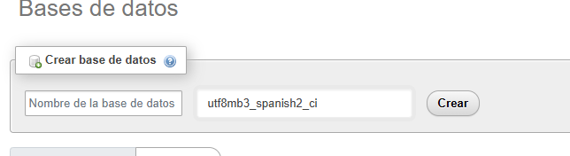

# 02 Como CREAR una BASE de DATOS en MySQL con PHPMYADMIN
1. Iniciamos sesion en localhost/phpmyadmin
2. user = root | pass no tiene
3. Bases de Datos
4. Crear base de datos
5. Nombre y UTF8mb3_spanish2_ci

