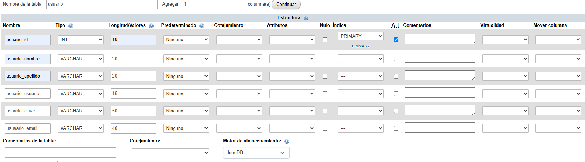

# 03 Como CREAR TABLAS en MySQL con PHPMYADMIN [EJEMPLO]

1. Ingreso a la DB deseada
2. Crear tabla, definir nombre y cantidad de columnas

**int** => numeros

**varchar** => texto

**AI** => auto incremental, se utiliza en el id

