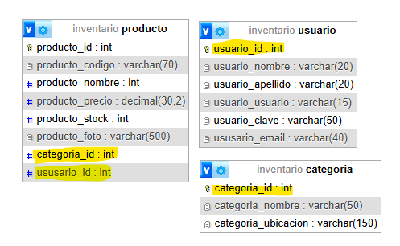
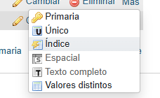
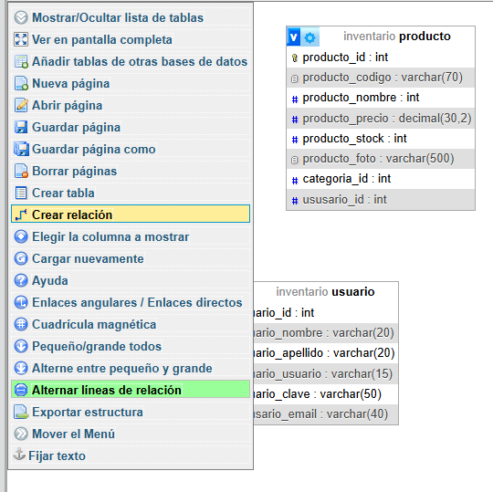
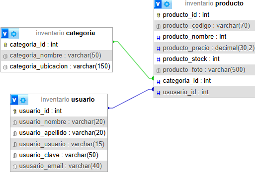

# 04 Como RELACIONAR TABLAS en MySQL con PHPMYADMIN [EJEMPLO]
Al crear tablas, nos encontramos con que todas deben tener una ***PRIMARY KEY***

Cuando creamos por ejemplo la tabla de **productos**, sabemos que debera ir ligada a la tabla de **categorias**, y a su vez a la tabla de **usuario**, por lo que, en la tabla **producto**, definimos las ***FOREING KEYS*** (llaves foraneas)
Para obtener la vista de la imagen, accedemos a la db y nos vamos a la pestania **DISENADOR**

## Indexar las Foreing Keys
Debemos acceder a la tabla **producto**, ir a estructura, encontrar la foreing key, mas, indice, ok

## Crear la relacion
Una vez indexadas las foreing keys, dentro de disenador, en el menu lateral, crear relacion, selecciono primero la **PRIMARY KEY** y segundo al **FOREING KEY**

Una vez hecho esto, actualizamos y quedarian graficamente relacionadas asi

