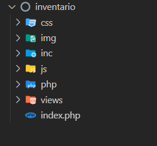

# 06 ESTRUCTURA de una APP WEB de SISTEMA de INVENTARIO
1. Ir a `C:\laragon\www`
2. Crear la carpeta `inventario`
3. Dentro de `inventario`, crear carpetas `css`, `img`, `inc`, `js`, `php`, `vistas`
4. En `index.php` crear el codigo HTML base

    